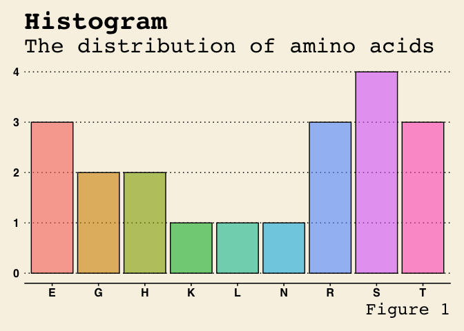

<!-- README.md is generated from README.Rmd. Please edit that file -->

```{r, include = FALSE}
knitr::opts_chunk$set(
  collapse = TRUE,
  comment = "#>",
  fig.path = "man/figures/README-",
  out.width = "100%"
)
```

# ZenDNA

<!-- badges: start -->
<!-- badges: end -->

The goal of ZenDNA is to outline the Central Dogma of Molecular Biology.

## Installation

You can install the development version of ZenDNA like so:

```{r, eval = FALSE}
install.packages("devtools")
devtools::install_github("s172084/ZenDNA")
```

```{r echo=FALSE, include=FALSE}
library(ZenDNA)
```

### Data: the_codon_table

```{r}
data("the_codon_table")
```

To explore the basic data manipulation verbs of ZenDNA, we'll use the dataset `the_codon_table`. 
This dataset comes from the [The Genetic Codes](https://www.ncbi.nlm.nih.gov/Taxonomy/Utils/wprintgc.cgi?chapter=tgencodes#SG1), and is documented in `?the_codon_table`

```{r}
dim(the_codon_table)
the_codon_table
```


## Overview

ZenDNA is a package regarding the Central Dogma of Molecular Biology.

ZenDNA provides a consistent set of verbs that help you solve the most common molecular biology challenges.

* `create_dna()` generates a random sample of DNA. 

* `create_rna()` substitutes nucleotides in DNA to create RNA. 

* `create_codon()` makes codons based on the RNA sequence. 

* `create_polypeptide()` makes polypeptides based on the codon sequence. 

* `find_aa_distribution()` makes a histogram of the distribution of counts of amino acids in a polypeptide.

* `the_codon_table` Codon to Amino Acid table. 


You can learn more about the functions in `vignette(ZenDNA)`.

If you are new to ZenDNA, the best place to start is this github repository.

(If you're trying to generate a protein sequence from a DNA sequence, see `vignette(ZenDNA)`)


## Usage

**Synthesize DNA with** `create_dna()`

The first verb is `create_dna()`. It creates a string of DNA 

```{r, eval = FALSE}
dna_seq <- create_dna(300)
```

***


**Transcribe RNA with** `create_rna()`

The second verb is `create_rna()`. It creates a string of RNA 

```{r, eval = FALSE}
rna_sequence <- create_rna(dna_seq)
```

***

**Start Initiation and Elongation of RNA with** `create_codon()`

The third verb is `create_codon()`. It creates separate strings of codons

```{r, eval = FALSE}
codon_produced <- create_codon(rna_sequence)
```

***

**Protein structure creation with** `create_polypeptide()`

The fourth verb is `create_polypeptide()`. It creates a polypeptide sequence from the codons.


```{r, eval = FALSE}
polypeptide_sequence <- create_polypeptide(c("AUG", "CAA", "CGA", "UCA"))
polypeptide_sequence
```

***

**Find the distribution of amino acids in the polypeptide with** `find_aa_distribution()`

The fifth verb is `find_aa_distribution()`. It plots a histogram of the distribution of amino acids in the polypeptide.


```{r}
distrib_plot <- find_aa_distribution("HEGGHNRSRSSRTTSLKEET")
```

```{r echo=FALSE, fig.align='left', out.width='60%'}

```


***

## Getting help

If you encounter a clear bug, please file an issue with a minimal reproducible example on GitHub.
For questions and other discussion, please email `s172084@dtu.dk`

Please note that this project is released with a Contributor Code of Conduct. By participating in this project you agree to abide by its terms.
